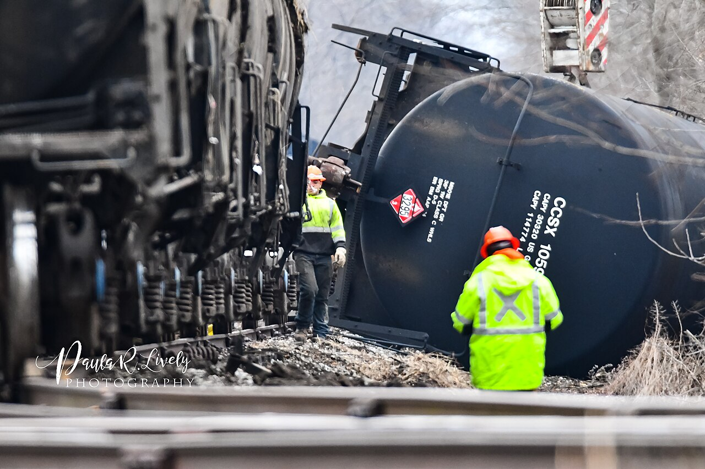

# Railway Incident Review

[](https://github.com/dilipreddykiralam-png/railway-incident-review/actions/workflows/tests.yml)

**[Explore the free sample demo](https://dilipreddykiralam-png.github.io/railway-incident-review/)** · **Public testing-session count: not connected**

The sample demo shows saved model responses. New uploads require the locally running app; live public inference is not deployed yet. See [free hosting options and counter setup](docs/HOSTING.md).

A local application that turns railway images and sampled video frames into structured incident and damage findings, with supporting images and human verification.

Built with **Qwen2.5-VL 7B**, Ollama, Streamlit, Pydantic and OpenCV. The project combines visual assessment, validation, a review interface and reproducible evaluation tools. It uses a pretrained model; no railway-specific training has been performed.

**Upload an image or video → analyze visible evidence → inspect findings → confirm or correct → save the reviewed report.**

## Why this project exists

Reviewing incident media involves identifying the relevant assets, describing visible damage and turning observations into a consistent report. This application drafts that report and keeps the evidence close to each finding. A reviewer can add a missed asset, remove an unsupported claim or correct the component and severity without losing the original model response.

It is a portfolio and research prototype for assisted visual review. It has not been validated for operational railway safety decisions.

## What it does

- Accepts one image or video at a time.
- Reports incident classification, multiple assets, components, damage type, visual severity, confidence and a reason for each finding.
- Separates visible damage, suspected damage and involvement without visible damage.
- Displays sampled video images with timestamps and their individual responses, followed by one event summary.
- For mixed video results, shows one representative non-incident frame plus incident and review-needed frames. If all samples are classified non-incident, retains the samples and provides one brief summary.
- Preserves original predictions, raw model responses and human corrections in JSON.
- Includes an independent labelling interface and image evaluation tools.
- Keeps the backend modular so a detector or another inference service can be added later.

For videos, “no incident found” applies to the **sampled frames**, not every moment of the clip. Before/after accident comparison is deferred to a later interface stage.

## Examples and evidence

Start with the [sample images and saved model outputs](docs/SAMPLE_RESULTS.md). Media credits and reuse terms are in [ATTRIBUTION.md](ATTRIBUTION.md).



Example input: photo by Paula R. Lively, [CC BY 2.0](https://creativecommons.org/licenses/by/2.0/), resized by Wikimedia Commons. [Source and full credit](ATTRIBUTION.md) · [Actual Qwen 7B output and review notes](docs/SAMPLE_RESULTS.md).

The application supports assets such as locomotives, wagons, passenger coaches, track, signals, catenary, crossing barriers and road vehicles. Each can have a separate damage finding. The sample outputs are actual example runs, not an independently measured accuracy benchmark.

**Software validation: 120 automated tests passed.** These test validation, video presentation, correction handling, dataset export and scoring behavior. This is a software reliability result, **not recognition accuracy**. See the [saved test result](docs/software-test-results.json) and [evaluation scope and instructions](docs/EVALUATION.md).

## General system requirements

These are practical starting recommendations, not measured minimums for every computer.

| Component | Recommendation |
| --- | --- |
| Operating system | Windows, macOS or Linux supported by current Python and Ollama releases |
| Python | 3.11 in a separate virtual environment |
| RAM for local Qwen 7B | Start with 16 GB; more memory gives headroom for model context, video and other applications |
| GPU | Compatible acceleration recommended; CPU inference may be much slower. The app does not require a particular GPU brand |
| Disk | Allow roughly 15 GB free for model weights, Python packages and temporary files; verify available space before downloading |
| Browser | Current Chrome, Edge, Firefox or Safari |
| Network | Needed for installation/model download; default local inference can run after downloading |

If using a remote model server, the local computer does not load model weights. Exact hardware in [sample run metadata](examples/outputs/run_metadata.json) describes that experiment only; it is not a requirement. Software CI runs on Linux; the local suite has also been run on macOS. Windows instructions are provided but a Windows run has not been independently verified.

## Run locally

### 1. Install the model

Install [Ollama](https://ollama.com/download) and keep it running. Download the vision model:

```bash
ollama pull qwen2.5vl:7b
ollama list
```

If Ollama is not already running, start it in a separate terminal:

```bash
ollama serve
```

If the address is already in use, the service may already be running; do not start a second instance. The default local service uses port `11434`. Model details are documented on the [official Ollama model page](https://ollama.com/library/qwen2.5vl:7b).

### 2. Install the application

Use Python 3.11 for a new environment. In a terminal:

```bash
git clone https://github.com/dilipreddykiralam-png/railway-incident-review.git
cd railway-incident-review
python3 -m venv .venv
source .venv/bin/activate
python -m pip install --upgrade pip
python -m pip install -r requirements.txt
```

On Windows PowerShell, replace the virtual environment commands with:

```powershell
py -3.11 -m venv .venv
.venv\Scripts\Activate.ps1
```

Then run the same `python -m pip` commands above.

### 3. Start the application

The defaults target local Ollama and `qwen2.5vl:7b`:

```bash
python -m streamlit run app.py --server.address 127.0.0.1 --server.port 8503
```

Open [http://127.0.0.1:8503](http://127.0.0.1:8503). Choose **vlm**, upload an image or video, and select **Analyze**. Inspect the evidence and use **Human verification** to confirm or correct the report. Save the verification and download the result JSON.

The **demo** backend returns a fixed, clearly marked uncertain result. It is useful for checking the interface without a model; it does not analyze the image.

### Optional configuration

The application reads process environment variables. A `.env` file is **not loaded automatically**. To use the supplied settings in macOS/Linux:

```bash
cp .env.example .env
set -a
source .env
set +a
python -m streamlit run app.py --server.address 127.0.0.1 --server.port 8503
```

For PowerShell, set the variables directly before starting the application:

```powershell
$env:VLM_BASE_URL = "http://localhost:11434/v1"
$env:VLM_MODEL = "qwen2.5vl:7b"
$env:VLM_API_STYLE = "ollama"
python -m streamlit run app.py --server.address 127.0.0.1 --server.port 8503
```

With the default local endpoint, uploaded images are sent to Ollama on your machine. Configuring another endpoint sends them to that endpoint instead. The model weights are downloaded by Ollama and are not stored in this repository.

## Human review and saved reports

The model's answer is a draft. A reviewer can confirm it or change the classification and asset findings, including adding missing damage findings. The app saves the original output and the reviewed result separately in `runs/`; that directory is excluded from Git.

Confidence is the model's uncalibrated self-assessment. Classification confidence and asset confidence refer to different questions and are labelled separately. Missing confidence is not invented. Visual severity describes the visible finding; it is not an engineering inspection or a repair-cost estimate.

Saving corrections **does not train or update Qwen**. Reviewed examples could support a later dataset after quality and permission checks. Evaluation images should remain separate from future training data.

## What users should expect

1. Upload a railway image or a short video and select Analyze.
2. The model returns incident / non-incident / uncertain, assets, components, damage, visible severity, confidence and evidence. It can return several asset findings.
3. Inspect the image or sampled frames beside the findings. Unknown severity and missing confidence remain explicitly unknown rather than invented.
4. Confirm or correct the draft, adding missed assets and removing unsupported claims.
5. Save verification and download JSON. Local saved reports include the original prediction and human corrections separately.

A schematic example could be “incident → wagon → body → deformation → severe,” accompanied by evidence and a self-reported confidence. This is an example of the output format, not a guaranteed answer. [Three real saved outputs](docs/SAMPLE_RESULTS.md) include both normal and incident scenes, limitations and known model mistakes.

This workflow can help researchers organize visual incident records and help reviewers draft consistent reports. It does not establish accident causes, certify asset condition or replace a railway inspection.

## Tests and evaluation

Run the automated software tests without downloading a model:

```bash
python -m pytest -q
```

A passing run prints a summary such as `120 passed in ...s`. The exact latest CI result is available through the Tests badge above. Tests exercise schema consistency, failed responses, video grouping, human corrections, evaluation scoring and counter behavior using controlled inputs; they do not prove the model identified damage correctly.

For an actual recognition study, label images independently before viewing model responses, freeze the test set and compare the original saved predictions against those labels. [EVALUATION.md](docs/EVALUATION.md) includes exact labelling, batch inference and scoring steps. Never use a successful software test count as an image accuracy percentage.

## Project structure

```text
app.py                 Image/video analysis and human review
label_app.py           Independent reference labelling interface
railreview/            Inference, validation, video handling and evaluation
prompts/               Versioned prompts and output schemas
examples/              Attributed sample images and saved outputs
tests/                 Automated software checks
docs/                  Architecture, evaluation and portfolio notes
.env.example           Local Ollama configuration
```

See [architecture](docs/ARCHITECTURE.md), [sample results](docs/SAMPLE_RESULTS.md), and [portfolio summary](docs/PORTFOLIO.md).

## Current limits and next steps

The model can miss damage, confuse assets or invent unsupported findings. Small or obscured components may be impossible to assess. Video analysis uses 2–12 uniformly sampled frames (6 by default), without audio, tracking or motion analysis; a brief incident can be missed between samples. Image uploads must be under 10 MB and at most 25 megapixels. Videos must be under 100 MB and at most 10 minutes.

Next steps are independent evaluation on more event-diverse media, improved frame selection, and testing a detector backend. Training would be a separate future experiment driven by measured errors.

Sample media retains its original licensing terms; see [ATTRIBUTION.md](ATTRIBUTION.md). Dependency and model licenses are separate. No project-wide open-source license is granted by this README.
