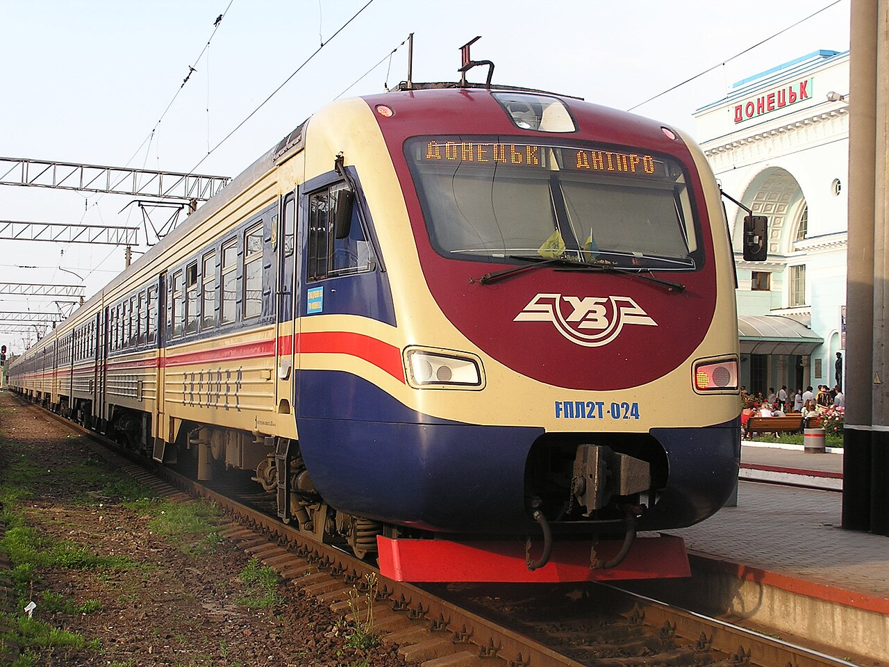
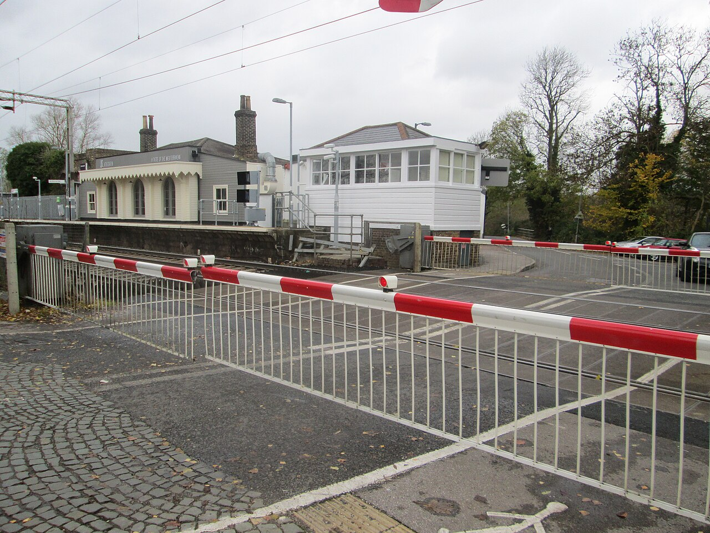

# Real sample runs with Qwen2.5-VL 7B

Three licensed photographs were processed locally on **23 September 2026** using the same pipeline as the application. These are **smoke examples**, not a measured recognition-accuracy benchmark: there are no independently annotated reference labels, and human verification remains pending. All three selected cases and their complete model responses are included. No model response was rewritten or replaced with a preferred answer.

## Observed outputs

| Example | Model scene classification | Projected visual severity | Model classification confidence | End-to-end time | Result file |
| --- | --- | --- | --- | --- | --- |
| Trinway derailed tank wagon | Incident | Unknown | 90% | 25.17 s | [Complete JSON](../examples/outputs/trinway-derailment.json) |
| Donetsk train at station | Non-incident | None | 90% | 25.26 s | [Complete JSON](../examples/outputs/donetsk-train.json) |
| Roydon level crossing | Non-incident | None | 90% | 19.22 s | [Complete JSON](../examples/outputs/roydon-crossing.json) |

**Execution result:** 3/3 cases produced schema-valid records in one request each; no validation retry was needed. This measures successful pipeline execution, **not 100% recognition accuracy**. Confidence is the model's uncalibrated self-assessment, not a probability established by testing. Latency includes preprocessing and model inference; first-call loading, hardware and other machine activity affect it.

### Derailment example: useful event finding, unsupported extra claims


*Photograph: Paula R. Lively, CC BY 2.0. [Full attribution](../ATTRIBUTION.md).*

The model identified a visible incident and a wagon described as a derailed tank car. It returned `suspected_damage`, `damage_type: unknown` and `severity: unknown`, with 80% confidence for that asset finding. This is separate from its 90% incident-classification confidence.

Review is still necessary:

- The response claims visible liquid and possible leaking. The photograph does not clearly establish that claim; it should not be treated as a confirmed spill.
- It adds road-vehicle and crossing-barrier findings while its own evidence says those assets are absent. These rows should be removed by a reviewer.
- A valid JSON response does not guarantee correct damage type, component or severity.

These issues are preserved in the raw output rather than silently corrected in the example. They illustrate why the application keeps the image visible and saves human corrections separately.

### Train-at-station example: no visible incident, asset labels need review



*Photograph: Andrey Butko, CC BY-SA 3.0. [Full attribution](../ATTRIBUTION.md).*

The model reported no visible incident and no visible damage. It nevertheless produced both passenger-coach and locomotive entries for the visible train front, plus an absent-road-vehicle entry. A railway reviewer should check the rolling-stock terminology and remove duplicate or unsupported asset rows. Its suggestion that the train is stationary cannot establish motion from a single image.

### Level-crossing example: a closed barrier is not automatically an incident



*Photograph: Peter S, CC BY-SA 2.0. [Full attribution](../ATTRIBUTION.md).*

The model reported no visible incident and no visible damage to the level-crossing barrier. It used `closed` as the component, which is a state rather than a component name. A reviewer can correct it to the appropriate visible component. A single photograph cannot establish the absence of earlier incidents or hidden defects.

## Run conditions

- Model: **Qwen2.5-VL 7B**, Ollama tag `qwen2.5vl:7b`, quantization `Q4_K_M`.
- Ollama: **0.34.0**, local native `/api/chat`, no cloud API.
- Host: **Apple M5, 16 GiB memory, arm64 macOS**; Python 3.9.6.
- Prompt/contract: `asset_first_v4` / `scene_assessment_v4`.
- Generation: temperature 0, context setting 8192, maximum output 2048 tokens, structured JSON schema.
- Preprocessing: EXIF orientation, RGB, longest side at most 1536 pixels, JPEG quality 90. Bundled inputs are already 1280 pixels wide.
- Pipeline permits one validation repair; none was required in these three cases.

The exact model digest, runtime metadata and case order are in [run_metadata.json](../examples/outputs/run_metadata.json). Each case also contains input/processed-image hashes, prompt/schema hashes, timestamps, original responses and attempt history. The Ollama metadata reports a total parameter-size string of `8.3B`; the actual installed model tag and published model family are `qwen2.5vl:7b` / Qwen2.5-VL 7B.

## Reproduce

After completing the repository [setup instructions](../README.md), keep Ollama running with `qwen2.5vl:7b` installed. From the repository root, with the Python environment activated:

```bash
python examples/run_examples.py
```

This sends the three bundled photographs to **local Ollama only** and writes a new `runs/examples-<timestamp>/` directory. It never overwrites the committed examples. Existing output filenames cause an error if an explicit `--output-dir` is reused. Different runtime versions or execution conditions can produce different results, even at temperature 0.

## What these examples demonstrate

They show the working path from image input through structured scene and asset findings to an auditable result awaiting human review. The application can help a reviewer begin a report and inspect evidence, while the reviewer confirms useful findings and removes unsupported claims. A claim about damage accuracy or reviewer time savings requires a separate labelled evaluation and, for time savings, a timed comparison with manual reporting. No such performance claim is made from these three examples.
